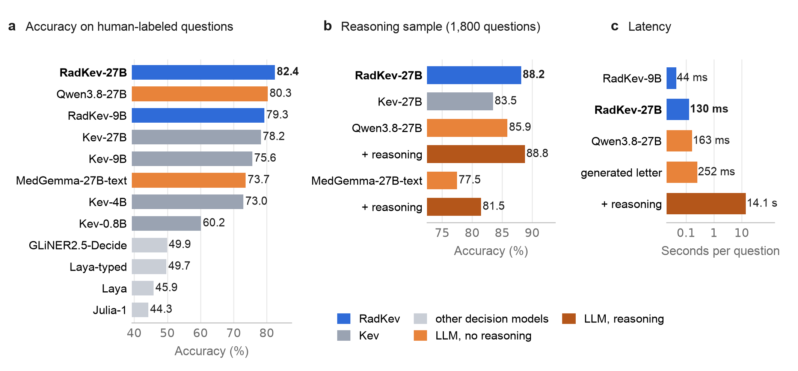
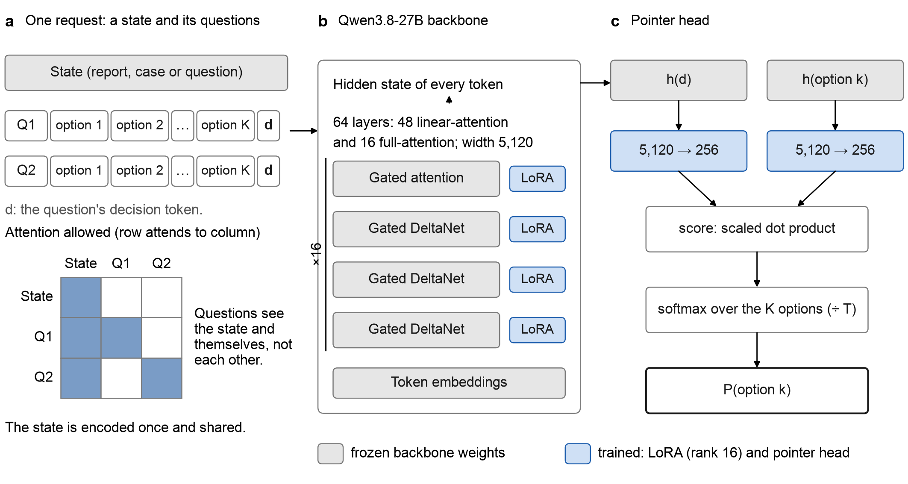
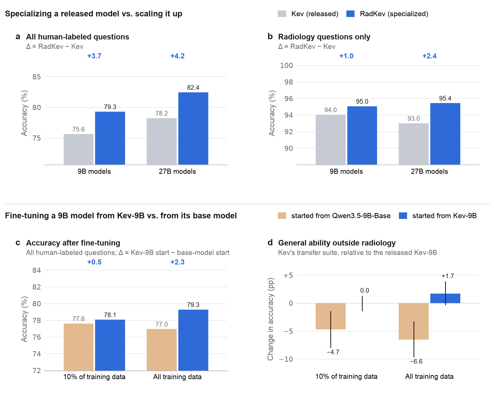
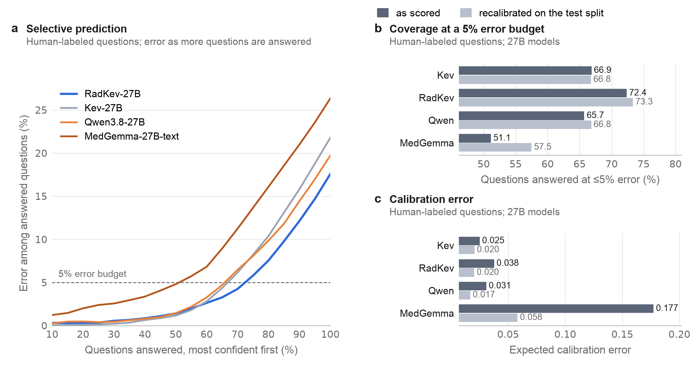
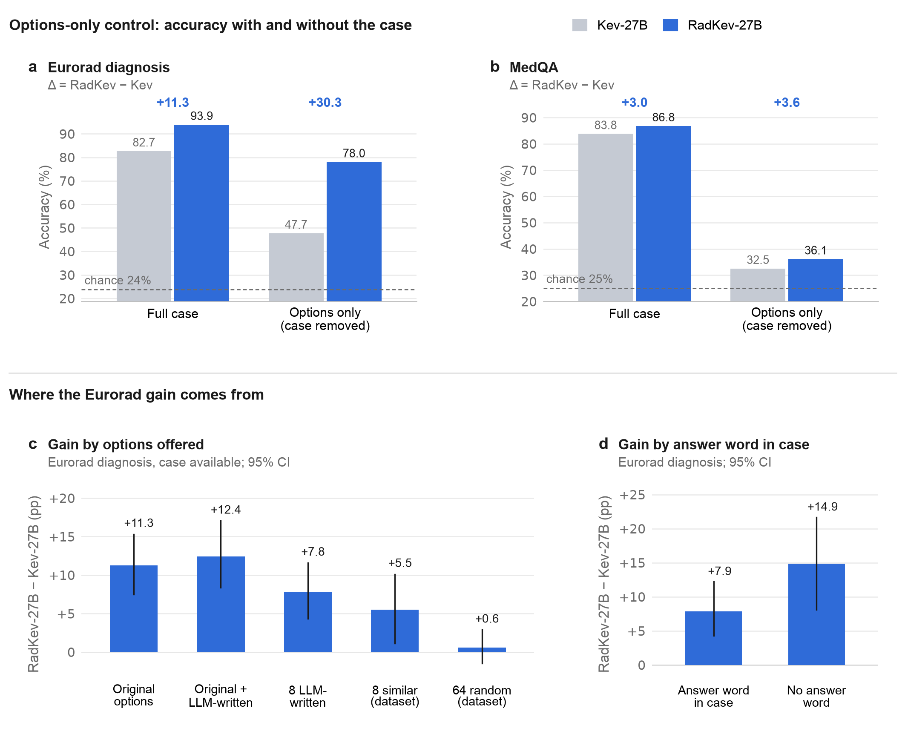

<div align="center">

# RadKev

**Specializing a Decision Model for Radiology: Comparison with General-Purpose Decision Models and Language Models**

Udbhav Ram and Ran Zhang · University of Wisconsin–Madison

[](https://github.com/udiram/RadKev/actions/workflows/ci.yml)
[](LICENSE)
[](MODEL_CARD.md)
[](https://github.com/jaredpalmer/kev)
[](MODEL_CARD.md)

</div>

This repository contains the code, results, figures and manuscript source of the RadKev study. RadKev-27B and RadKev-9B are
radiology-specialized decision models, obtained by continued training of the general-purpose decision models Kev-27B and Kev-9B
([Kev](https://github.com/jaredpalmer/kev)) on 67,164 public radiology and medical records. A decision model reads a *state* (a
report, a case or a clinical indication) together with one or more typed questions and returns, in one forward pass, a probability
for every admissible answer of every question. The study compares specialization with the two principal alternatives: larger
general-purpose decision models and large language models (LLMs) of the same size.

## Summary

The models were evaluated on 26,719 held-out questions (14,379 records) against eight general-purpose decision models and two LLMs,
Qwen3.8-27B and MedGemma-27B-text. Because the LLMs had generated some of the training labels, they were compared only on the 18,744
questions with answers assigned by people (*human-labeled* questions). The primary outcome, prespecified, was accuracy averaged
across 29 tasks relative to Kev-27B; all other analyses were post hoc. Differences are paired, with 95% confidence intervals from a
source-stratified cluster bootstrap (2,000 resamples).

- **Primary outcome.** Specialization increased task-averaged accuracy by 6.7 percentage points (95% CI 5.7 to 7.7), and by 3.6
  points (2.5 to 4.7) over the 16 human-labeled tasks.
- **Decision models and LLMs.** Kev-27B is built on Qwen3.8-27B. The shared backbone was less accurate as a general-purpose decision
  model than as an LLM (78.2% vs 80.3% on human-labeled questions) and more accurate after specialization (RadKev-27B 82.4%; +2.2
  points, 1.7 to 2.6), the highest of any system evaluated (MedGemma-27B-text, 73.7%).
- **Specialization and scale.** On human-labeled questions, the gain from specialization exceeded that of a threefold increase in
  model size (4.2 vs 2.6 points; difference 1.6, 0.9 to 2.3), but not when accuracy was averaged over tasks (3.8 vs 5.5).
- **Initialization.** Fine-tuning from Kev-9B rather than from its base model raised accuracy on human-labeled questions by 2.3
  points (1.9 to 2.8) and preserved general decision performance outside radiology.
- **Calibration and selective prediction.** At a 5% error budget, RadKev-27B could answer 72.4% of human-labeled questions (Kev-27B
  66.9%, Qwen3.8-27B 65.7%), but its probabilities were less well calibrated than those of Kev-27B (expected calibration error
  0.038 vs 0.025) until recalibrated.
- **Options-only control.** With the case removed, RadKev-27B still selected the correct Eurorad diagnosis in 78.0% of questions
  (Kev-27B 47.7%, chance 24%). Part of the gain in case diagnosis therefore derives from regularities of the answer options rather
  than from reading of the case.

<p align="center"></p>
<p align="center"><sub><b>Figure 5 of the manuscript.</b> Decision models and language models: accuracy on the 18,744 human-labeled questions (a), on
the 1,800-question sample on which the LLMs were also run with reasoning (b), and median latency per question (c).</sub></p>

## Models

| Model | Started from | Backbone (frozen) | Trained parameters | Weights |
|---|---|---|---|---|
| **RadKev-27B** | Kev-27B | Qwen3.8-27B | rank-16 LoRA + pointer head; T = 1.26 | [`ramu9703/radkev-27b-v2`](https://huggingface.co/ramu9703/radkev-27b-v2) |
| **RadKev-9B** | Kev-9B | Qwen3.5-9B-Base | rank-16 LoRA + pointer head; T = 1.23 | [`ramu9703/radkev-9b`](https://huggingface.co/ramu9703/radkev-9b) |

The weights are released under CC BY-NC-SA 4.0 for non-commercial research use, because several training sources (Eurorad, CT-RATE)
carry that license; access on the Hugging Face Hub requires acceptance of these terms. T is the temperature fitted on the
development split. See the [model card](MODEL_CARD.md) for intended use and limitations.

## Data

Every source is public (Eurorad, MedMCQA, MedQA, MMLU, PubMedQA, MedXpertQA, IU/Open-i, CT-RATE, CheXpert Plus, ReXGradient-160K);
[docs/DATA.md](docs/DATA.md) lists their licenses and how to obtain them, and `radkev.data` rebuilds every record deterministically.
The Hugging Face dataset [`ramu9703/radkev-data`](https://huggingface.co/datasets/ramu9703/radkev-data) holds the released data: the
question records built from the openly licensed sources; for IU/Open-i and the access-controlled sources, identifiers, state
hashes, answer keys and teacher labels without text; and the per-question probabilities of every system in every analysis.

## Quick start

```bash
git clone https://github.com/udiram/RadKev.git && cd RadKev
scripts/setup.sh                                  # Kev at the pinned commit + venv, with radkev installed into it
source ~/.cache/radkev/kev/.venv/bin/activate
```

Ask a checkpoint the three example requests in [`examples/`](examples/) (written for illustration, not taken from any dataset):

```bash
python examples/quickstart.py --run ramu9703/radkev-9b
python examples/quickstart.py --run jaredpalmer/kev-4b           # the general-purpose model, small enough for a laptop
```

Serve a checkpoint over HTTP with Kev's server:

```bash
python -m kev.serve --run ramu9703/radkev-27b-v2 --port 8009
examples/request.sh                                               # POST /v1/systemone
```

From Python:

```python
from radkev.predict import Predictor

radkev = Predictor("ramu9703/radkev-27b-v2")
out = radkev({"state": "FINDINGS: Small left pleural effusion. No pneumothorax.",
              "questions": {"ptx": {"type": "noul", "instructions": "Does this report describe pneumothorax?"}}})
out["answers"]["ptx"]["noul"]       # P(yes)
```

A request is the [TypeSafe System One](https://docs.typesafe.ai/api) body that Kev serves. Questions are of three types, `noul`
(yes/no), `choice` (named options) and `score` (ordered levels), and every answer is returned as a full distribution over the
admissible options. All questions about one state are answered in one pass and cannot read each other.

RadKev-27B requires about 55 GB in bfloat16: one 80 GB GPU, or two 48 GB GPUs with `KEV_DEVICE_MAP=auto KEV_DTYPE=bf16` (enabled
by [`patches/kev_multigpu.patch`](patches/kev_multigpu.patch), which `setup.sh` applies; verified to give scores identical to
single-GPU inference). RadKev-9B fits on one 48 GB GPU.

## Methods

**Data.** The records cover three kinds of decision made on radiology text: reading a report (IU/Open-i chest radiograph reports,
CT-RATE chest CT reports), diagnosing a case (Eurorad teaching cases: final diagnosis among the case's differential diagnoses, and
routing to one of 11 subspecialty sections) and applying medical knowledge (MedMCQA, MedQA, MMLU, PubMedQA, MedXpertQA). Records were
split by patient or case into 67,164 training, 8,553 development and 14,379 test records; official test sets were retained, one
instruction wording per question kind was withheld from training, and IU, MMLU, PubMedQA and MedXpertQA were used only for
development and testing. See [docs/DATA.md](docs/DATA.md).

**LLM-derived labels.** Decisions about imaging orders, triage and follow-up have no public answer keys. Candidate questions were
generated from reports in CheXpert Plus, ReXGradient-160K and CT-RATE and from clinical indications in these sources and in Eurorad,
and answered by two LLM teachers, MedGemma-27B-text and Qwen3.8-27B. A question was retained only if both teachers ranked the same
answer first (22,557 of 33,000 candidates); the mean of the two distributions served as a soft training target. These
*model-labeled* questions were used for training, and their test results are reported only as agreement with the teachers.

**Training.** Kev adds a rank-16 low-rank adapter to every linear projection of a frozen backbone, together with a pointer head that
scores each option against its question. RadKev-27B and RadKev-9B were trained for one epoch (8,521 optimizer steps) from the
released Kev-27B and Kev-9B, with 1,000 records of Kev's own training data replayed to limit the loss of general decision skill;
RadKev-27B trained for 25.7 h on two RTX A6000 GPUs and RadKev-9B for 10.9 h on one. A temperature was then fitted on the
development split.

**Evaluation.** The analysis plan ([docs/ANALYSIS_PLAN.md](docs/ANALYSIS_PLAN.md)) was committed on 26 September 2026, before any
test result was read. LLMs were scored zero-shot, one question per prompt, from the softmax of their next-token logits over the
option letters with reasoning disabled, and additionally with reasoning enabled on a stratified sample of 1,800 human-labeled
questions. Departures from the plan and all post hoc analyses are listed in [docs/EVALUATION.md](docs/EVALUATION.md).

<p align="center"></p>
<p align="center"><sub><b>Figure 2 of the manuscript.</b> Architecture of Kev, the decision model fine-tuned in this study, shown for Kev-27B.</sub></p>

## Results

All results are on the held-out test split. Values in parentheses are 95% confidence intervals of paired differences.

| System | Type | Size | Human-labeled | Radiology, human-labeled | All questions | All tasks, task mean |
|---|---|---:|---:|---:|---:|---:|
| **RadKev-27B** | decision model, radiology | 27B | **82.4** | **95.4** | **87.2** | **90.1** |
| **RadKev-9B** | decision model, radiology | 9B | 79.3 | 95.0 | 84.8 | 86.9 |
| Kev-27B | decision model, general | 27B | 78.2 | 93.0 | 82.9 | 83.3 |
| Kev-9B | decision model, general | 9B | 75.6 | 94.0 | 80.4 | 79.1 |
| Kev-4B | decision model, general | 4B | 73.0 | 92.6 | 78.2 | 75.5 |
| Kev-0.8B | decision model, general | 0.8B | 60.2 | 85.7 | 68.2 | 59.7 |
| GLiNER2.5-Decide | decision model, general | 0.49B | 49.9 | 73.0 | 53.6 | 44.4 |
| Laya-typed-decisions | decision model, general | 0.42B | 49.7 | 72.2 | 51.3 | 45.3 |
| Laya | decision model, general | 0.42B | 45.9 | 64.8 | 46.8 | 43.3 |
| Julia-1 | decision model, general | 0.14B | 44.3 | 62.5 | 45.9 | 34.8 |
| Qwen3.8-27B | LLM, general | 27B | 80.3 | 94.9 | 85.0 | 89.1 |
| MedGemma-27B-text | LLM, medical | 27B | 73.7 | 91.3 | 79.3 | 82.0 |

<sub>Accuracy (%). Human-labeled and radiology human-labeled: pooled over questions. All tasks, task mean: unweighted mean over the
29 test tasks. The LLM columns that include model-labeled questions measure in part agreement with the LLMs' own labels and are
shown for completeness. Confidence intervals for every value are given in the manuscript's supplementary tables and in [`results/tables/`](results/tables/).</sub>

### Primary comparison

With the prespecified demonstration sample excluded, task-averaged accuracy was 6.7 percentage points higher for RadKev-27B than
for Kev-27B (5.7 to 7.7); on the full test set it rose from 83.3% to 90.1%. The gain was concentrated in model-labeled tasks: over
the 16 human-labeled tasks the prespecified difference was 3.6 points (2.5 to 4.7). Among human-labeled families, accuracy improved
on chest radiograph report reading (+2.1), case diagnosis (+11.3) and medical knowledge (+6.2); subspecialty routing did not change
detectably (−1.1, −5.4 to 3.2).

<p align="center"></p>

### Decision models and language models

On human-labeled questions RadKev-27B was the most accurate system (82.4%), above its own backbone used as an LLM (Qwen3.8-27B,
80.3%; +2.2, 1.7 to 2.6) and MedGemma-27B-text (73.7%; +8.8, 8.2 to 9.3), whereas the released Kev-27B was 2.1 points below
Qwen3.8-27B. On the 1,800-question reasoning sample, RadKev-27B without reasoning (88.2%) did not differ detectably from Qwen3.8-27B
with reasoning (88.8%; −0.6, −1.9 to 0.7), although averaged over tasks the reasoning LLM was more accurate (−2.5, −4.3 to −0.8).
The median latency per question was 130 ms for RadKev-27B and 44 ms for RadKev-9B; Qwen3.8-27B took 163 ms when scored from its
option-letter logits, 252 ms for a generated answer letter and 14.1 s with reasoning. With one question per request, letter-scored
LLMs are about as fast as a decision model; the advantage lies in avoiding generation and reasoning and in answering all questions
about a record in one pass.

### Specialization, scale and initialization

On human-labeled questions, specialization raised accuracy by 4.2 points at 27B and 3.7 at 9B, whereas the threefold increase in
size from Kev-9B to Kev-27B raised it by 2.6; RadKev-9B was more accurate than Kev-27B (+1.1, 0.6 to 1.5). Averaged over tasks, the
gain from scale (5.5) exceeded that from specialization at 27B (3.8), so the comparison depends on how tasks are weighted. Starting
from Kev-9B rather than from Qwen3.5-9B-Base raised accuracy by 2.3 points with all of the training data and preserved general
decision performance outside radiology (+1.7 vs −6.6 points relative to Kev-9B); the two starts also differ in learning rate.

<p align="center"></p>

### Calibration and selective prediction

Answering human-labeled questions in descending order of confidence, RadKev-27B could answer 72.4% while keeping the error at or below
5%, compared with 66.9% for Kev-27B, 65.7% for Qwen3.8-27B and 51.1% for MedGemma-27B-text. Its expected calibration error was higher
than that of Kev-27B (0.038 vs 0.025) and it made more confident errors (2.0% vs 0.5%); after cross-fitted recalibration the two
calibration errors were equal (0.020) and the coverage advantage remained (73.3% vs 66.8%).

<p align="center"></p>

### Robustness of the gains

The gain on human-labeled questions was 3.8 points on withheld instruction wordings and 4.7 on wordings seen in training. In the
options-only control, in which the case was replaced by the sentence "No case information is available." and only the question and
its options were shown, RadKev-27B selected the correct Eurorad diagnosis in 78.0% of questions (Kev-27B 47.7%, chance 24%), whereas
on MedQA both models fell close to chance. The Eurorad gain depended on the alternatives offered: 11.3 points with the case's own
differential diagnoses, but 0.6 (−1.4 to 2.9) with 64 randomly chosen diagnoses.

<p align="center"></p>

### Size and composition of the answer space

Accuracy depended more on how similar the alternatives were to the correct answer than on how many were offered. With the most
similar alternatives, RadKev-27B was the most accurate system on Eurorad diagnosis at every answer-space size; on MedQA its advantage
was confined to small answer spaces. The LLMs were evaluated with at most 16 options, because each option must be labeled by a
single letter whose next-token probability is read; decision models score each option directly and accept up to 255 options per
question. From two to 16 options, the latency of RadKev-27B rose from 251 to 350 ms and that of the letter-scored LLMs from about
240 to 300 ms.

<p align="center"></p>

## Limitations

- The questions on imaging orders, triage and follow-up were labeled by agreement of two LLMs without validation against human
  judgment; results on these tasks are reported only as agreement.
- Part of the gain in case diagnosis derives from regularities of the answer options (options-only control).
- The comparison of starting points differs in learning rate as well as in initialization, and every model was trained once, with a
  single random seed.
- Public examination questions and Eurorad cases may have been part of the pretraining data of every model; paired differences,
  not absolute accuracies, are the basis of the conclusions.
- The analysis plan was not publicly registered: its commit is in a private repository, and it is reproduced verbatim in
  [docs/ANALYSIS_PLAN.md](docs/ANALYSIS_PLAN.md). All analyses other than the primary and prespecified secondary comparisons
  were added after the primary results were known.
- Latency was measured one request at a time; served LLMs with batching would have higher throughput.
- All questions were posed on text; the study does not address decisions that require the images.

## Reproducing the study

[docs/REPRODUCE.md](docs/REPRODUCE.md) describes every step from download to the final comparison: data construction
(`radkev.data`), teacher labeling (`experiments/teacher_labels.py`), training (`experiments/train.py`), the held-out evaluation
(`experiments/final_test.py`, `decision_baselines.py`, `llm_scoring.py`), the post hoc analyses and the manuscript build
(`paper/build.py`). The data builders are
deterministic, and [`results/manifests/`](results/manifests/) holds the expected record and question counts per source, split and
task. [`results/`](results/) contains every aggregate result, and [`results/numbers.csv`](results/numbers.csv) lists every number
in the manuscript with the file and field it was taken from.

## Repository

```
radkev/            the library (each module is also a CLI: python -m radkev.<module> --help)
  data.py          sources -> Kev records: patient/case splits, withheld wordings, leak filters
  teacher.py       two-teacher agreement labels; zero-shot LLM scorer (option-letter probabilities)
  evaluate.py      score a checkpoint or precomputed probabilities with Kev's metrics
  compare.py       paired cluster-bootstrap comparisons by decision family, task, label type and wording
  predict.py       in-process inference returning System One answers
  fetch.py         download the open sources
experiments/       the runs behind every reported number
patches/           the two-GPU split for Kev-27B on 48 GB GPUs
results/           aggregate results, the manuscript's number ledger, manifests and training configurations
paper/             the manuscript source and build.py, which generates every number, table and figure from paper/inputs/
figures/           the manuscript figures
docs/              data, evaluation, analysis plan and reproduction
examples/          example requests written for illustration and a quick-start script
tests/             tests on synthetic fixtures (run against Kev's metrics in CI)
```

## Intended use

RadKev is a research model. It is not a medical device, has not been prospectively validated and must not be used for clinical
decisions. It reads English text only (reports, vignettes, clinical indications), never images. Before any local evaluation, the
temperature should be refitted and automation thresholds set on locally labeled cases, and the answer spaces should be checked to
contain the correct answer; the manuscript's Discussion gives guidance on choosing answer spaces.

## Citation

```bibtex
@article{ram2026radkev,
  title  = {Specializing a Decision Model for Radiology: Comparison with General-Purpose Decision Models and Language Models},
  author = {Ram, Udbhav and Zhang, Ran},
  year   = {2026},
  note   = {Manuscript in preparation},
  url    = {https://github.com/udiram/RadKev}
}
```

## Acknowledgments

RadKev is built on [Kev](https://github.com/jaredpalmer/kev) by Jared Palmer (Apache-2.0) and on the Qwen backbones. We thank the
providers of the datasets: Open-i and Indiana University (IU chest radiograph reports), the European Society of Radiology (Eurorad)
and the authors of `wanglab/eurorad-reasoning`, the CT-RATE, CheXpert Plus and ReXGradient-160K teams, and the authors of MedMCQA,
MedQA, MMLU, PubMedQA and MedXpertQA. Comparators: MedGemma (Google), Qwen3.8 (Alibaba), Laya, Laya-typed-decisions, Julia-1 and
GLiNER2.5-Decide.
