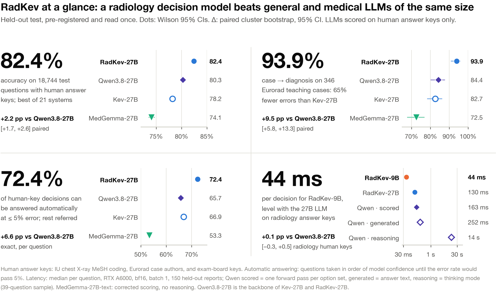
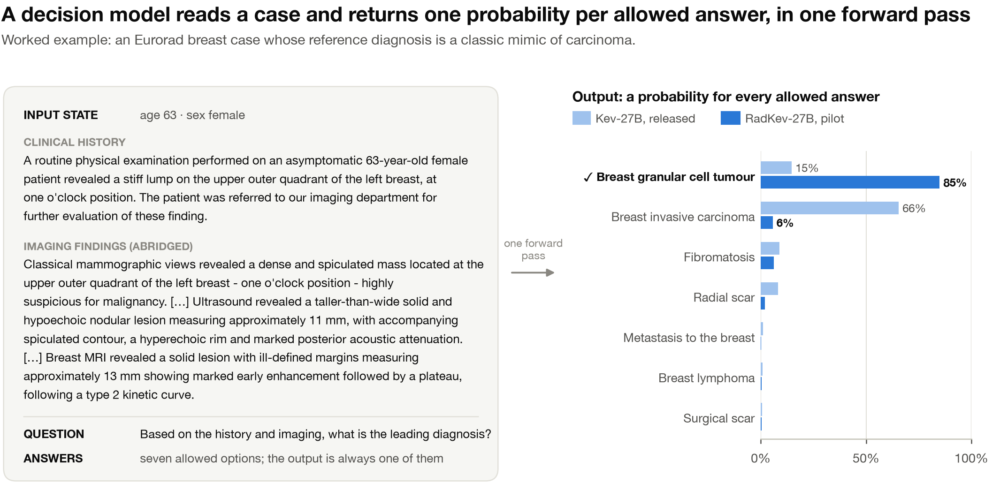
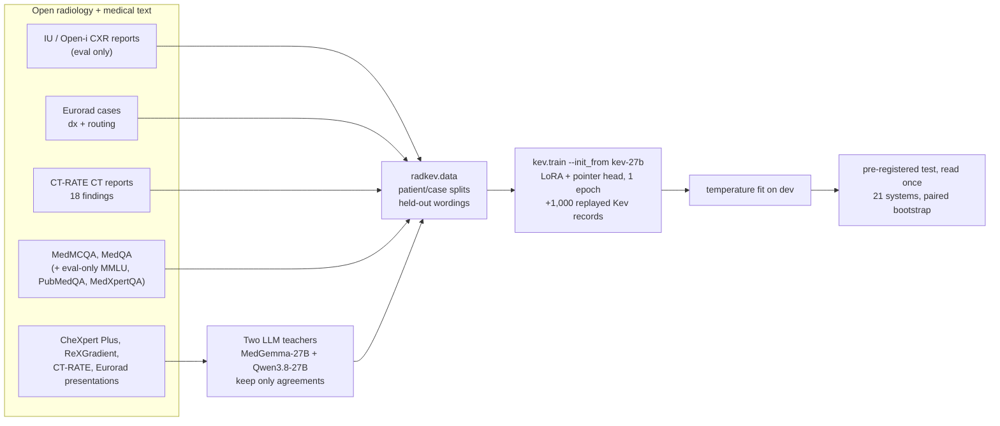
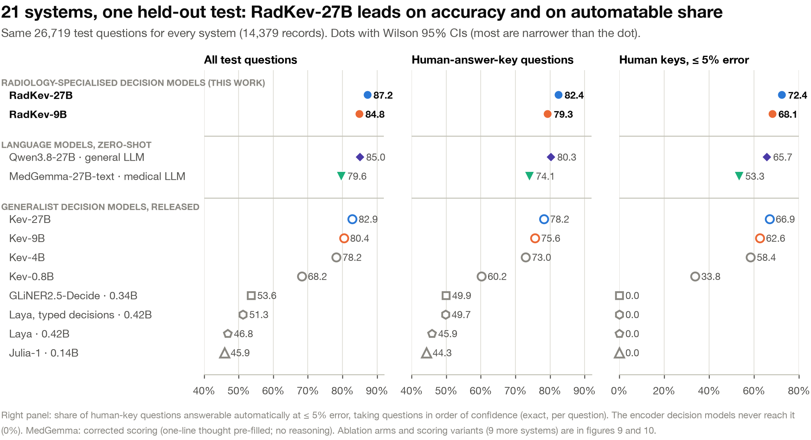
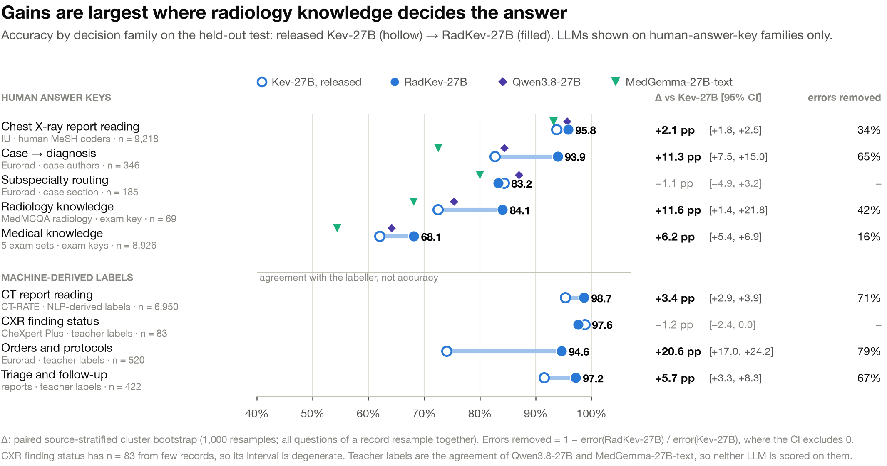
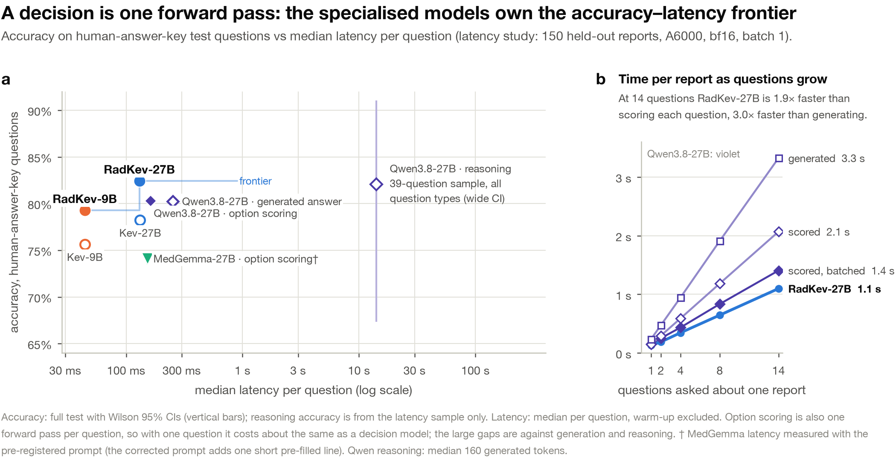
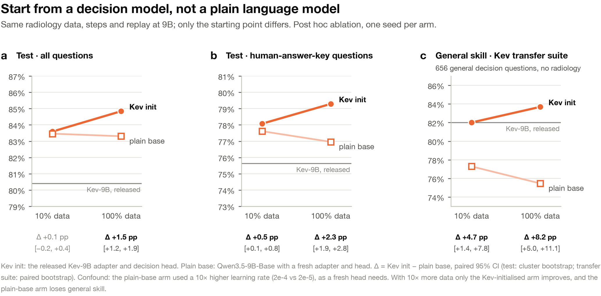
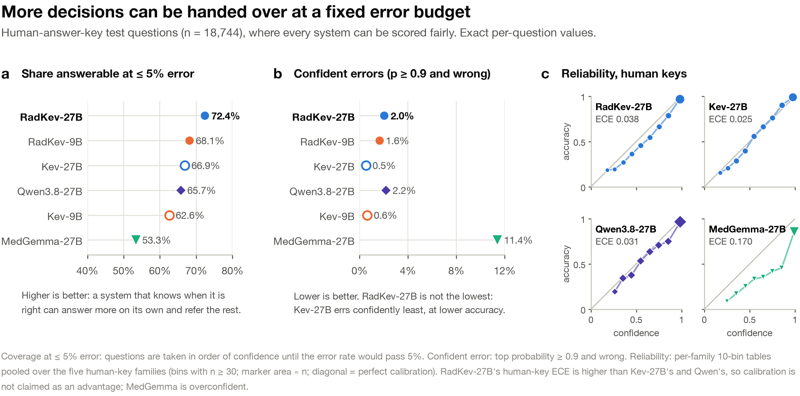

<div align="center">

# RadKev

**Specialise the decision, not the chatbot.**<br>
A radiology decision model that reads a report or case and returns a calibrated probability for every allowed answer, in one forward pass.

[](https://github.com/udiram/RadKev/actions/workflows/ci.yml)
[](LICENSE)
[](https://github.com/jaredpalmer/kev)
[](docs/PREREGISTRATION.md)
[](MODEL_CARD.md)

</div>

<p align="center"></p>

Most clinical AI work fine-tunes a chatbot. But a lot of radiology is not open-ended text: *is there an effusion, which exam first, how urgent, which reading list, what is the diagnosis among these five*. Those are **bounded decisions**, and a *decision model* answers them directly: give it a state (a report, a vignette, an order) and typed questions, and it returns one probability distribution per question, over exactly the allowed answers, from a single forward pass. Nothing is generated, so nothing has to be parsed, and every output can be thresholded, referred or audited.

RadKev is, to our knowledge, the first domain-specialised decision model. It is a delta fine-tune of [Kev](https://github.com/jaredpalmer/kev), an open generalist decision model, on open radiology and medical text. On a pre-registered held-out test of **26,719 questions**, it is the most accurate of **21 systems**, including generalist decision models from 144M to 27B parameters and same-size general and medical LLMs.

## Highlights

| | |
|---|---|
| 🎯 **Most accurate of 21 systems** | 87.2% on all test questions; **82.4%** on the 18,744 with human answer keys (Qwen3.8-27B 80.3%, Kev-27B 78.2%, MedGemma-27B-text 74.1%). |
| 🩻 **Diagnosis from a case** | **93.9%** on 346 Eurorad teaching cases, up from 82.7% for the released Kev-27B: 65% fewer errors (+11.3 pp [+7.5, +15.0]). |
| 🧮 **Automates the most at a fixed error rate** | Taken in order of confidence, **72.4%** of human-key decisions can be answered at ≤5% error (Qwen3.8-27B 65.7%, MedGemma 53.3%). |
| ⚡ **Small and fast** | RadKev-9B matches Qwen3.8-27B on radiology human-key questions (+0.1 pp [−0.3, +0.5]) at **44 ms per decision** on one GPU. Asking an LLM to generate the answer takes 252 ms; with reasoning, 14 s. |
| 🧬 **Start from a decision model** | Same data, same recipe at 9B: starting from Kev beats starting from the plain backbone (+1.5 pp test, **+8.2 pp** on general decision skill), which the plain start loses. |
| 🔒 **Honest by construction** | Pre-registered primary analysis, test read once, paired cluster bootstrap CIs, LLMs compared on human answer keys only, and a reported negative result (below). |

## What a decision looks like

<p align="center"></p>

<sub>Illustration only, not a result: the pilot RadKev-27B (v0) on one held-out case. Case text: Eurorad case <a href="https://www.eurorad.org/case/17041">17041</a>, “Breast granular cell tumor – a rare entity”, CC BY-NC-SA 4.0, abridged.</sub>

The request is the [TypeSafe System One](https://docs.typesafe.ai/api) body that Kev serves, so any Jev/Kev client works unchanged:

```jsonc
{
  "state": {"exam": "Chest radiograph", "findings": "The cardiac silhouette is enlarged ...", "impression": "..."},
  "questions": {
    "effusion": {"type": "noul",   "instructions": "Does this report describe pleural effusion?"},
    "change":   {"type": "choice", "instructions": "How have the findings changed compared with the prior study?",
                 "criteria": {"improved": "...", "worse": "...", "stable": "...", "mixed": "...", "new": "..."}},
    "urgency":  {"type": "score",  "instructions": "How urgent is clinical action based on this report?",
                 "criteria": ["Routine", "Within days", "Same day", "Immediate"]}
  }
}
```

Every answer comes back as a full distribution: `{"type": "choice", "choice": "worse", "confidence": 0.93, "probabilities": {...}}`.

## Quick start

```bash
git clone https://github.com/udiram/RadKev.git && cd RadKev
scripts/setup.sh                                  # Kev at the pinned commit + venv, with radkev installed into it
source ~/.cache/radkev/kev/.venv/bin/activate
```

Ask a checkpoint the three example cases in [`examples/`](examples/) (all invented for illustration):

```bash
python examples/quickstart.py --run <radkev-checkpoint>          # see "Weights" below
python examples/quickstart.py --run jaredpalmer/kev-4b           # the generalist, small enough for a laptop
```

Or serve it over HTTP with Kev's own server and call it from anything:

```bash
python -m kev.serve --run <radkev-checkpoint> --port 8009
examples/request.sh                                               # POST /v1/systemone
```

From Python:

```python
from radkev.predict import Predictor

radkev = Predictor("<radkev-checkpoint>")
out = radkev({"state": "FINDINGS: Small left pleural effusion. No pneumothorax.",
              "questions": {"ptx": {"type": "noul", "instructions": "Does this report describe pneumothorax?"}}})
out["answers"]["ptx"]["noul"]       # P(yes)
```

RadKev-27B needs about 55 GB in bf16: one 80 GB GPU, or two 48 GB GPUs with `KEV_DEVICE_MAP=auto KEV_DTYPE=bf16` (enabled by [`patches/kev_multigpu.patch`](patches/kev_multigpu.patch), which `setup.sh` applies; verified bit-identical to single-GPU scoring). RadKev-9B fits one 48 GB GPU.

## Weights

| Model | Started from | Checkpoint | Where |
|---|---|---|---|
| **RadKev-27B** | Kev-27B (Qwen3.8-27B backbone, frozen) | LoRA adapter + decision head + fitted temperature (T = 1.26), 455 MB on top of the base | [`ramu9703/radkev-27b-v2`](https://huggingface.co/ramu9703/radkev-27b-v2) |
| **RadKev-9B** | Kev-9B (Qwen3.5-9B-Base backbone, frozen) | LoRA adapter + decision head + fitted temperature (T = 1.23) | [`ramu9703/radkev-9b`](https://huggingface.co/ramu9703/radkev-9b) (gated) |

Because several training sources are non-commercial (Eurorad, CT-RATE: CC BY-NC-SA 4.0), the weights are for **non-commercial research use only**, and access on the Hub is gated on accepting those terms. They load like any Kev checkpoint (`--run ramu9703/radkev-27b-v2` or `--run ramu9703/radkev-9b`), or you can train your own with [docs/REPRODUCE.md](docs/REPRODUCE.md). See the [model card](MODEL_CARD.md).

## How it works



- **Architecture (unchanged from Kev).** A frozen Qwen backbone with a rank-16 LoRA on the attention, MLP and Gated-DeltaNet projections, and a pointer head that scores each option's end token against the question's decide token. All questions about one state share one pass and cannot read each other.
- **Recipe.** One epoch from the released Kev adapter and head (`kev.train --init_from jaredpalmer/kev-27b`), lr 3e-5, effective batch 8, bf16, states up to 1,536 tokens, plus 1,000 replayed Kev training records so general decision skill is kept. 8,521 steps, 25.7 h on two RTX A6000s. One temperature is then fitted on dev; it changes confidence, never an answer.
- **Data.** 67,164 training records across four decision families (report reading, case → diagnosis, orders/protocols, triage/follow-up). Splits are by patient or case, official test splits are kept, the IU reports are never trained on, and one instruction wording per question kind is held out of training so the test also measures robustness to unseen phrasing. Orders and triage have no open labels, so two open LLMs label them and only questions where both agree are kept (soft targets = their mean). See [docs/DATA.md](docs/DATA.md).

## Results

All numbers are on the held-out test (14,379 records, 26,719 questions), [pre-registered](docs/PREREGISTRATION.md) and read once. Δ = paired, source-stratified cluster bootstrap, 95% CI. Full tables in [`results/`](results/).

<p align="center"></p>

| System | Kind | All questions | Human answer keys | Case → diagnosis | Automatable at ≤5% error¹ | ms / decision² |
|---|---|---:|---:|---:|---:|---:|
| **RadKev-27B** | decision, radiology | **87.2** | **82.4** | **93.9** | **72.4** | 130 |
| **RadKev-9B** | decision, radiology | 84.8 | 79.3 | 91.0 | 68.1 | **44** |
| Qwen3.8-27B | LLM, general | 85.0 | 80.3 | 84.4 | 65.7 | 163 / 252 / 14,138 |
| Kev-27B | decision, general | 82.9 | 78.2 | 82.7 | 66.9 | 132 |
| Kev-9B | decision, general | 80.4 | 75.6 | 75.1 | 62.6 | 44 |
| MedGemma-27B-text³ | LLM, medical | 79.6 | 74.1 | 72.5 | 53.3 | 153 |
| Kev-4B / Kev-0.8B | decision, general | 78.2 / 68.2 | 73.0 / 60.2 | | 58.4 / 33.8 | |
| GLiNER2.5-Decide · Laya · Julia-1 | decision encoders, 0.14–0.42B | 45.9–53.6 | 44.3–49.9 | | 0.0 | |

<sub>¹ Share of human-key questions answerable, in order of model confidence, while keeping the error rate ≤ 5%. ² Median per question, RTX A6000, bf16, batch 1, 150 held-out reports; Qwen as option-letter scoring / generated answer / reasoning. ³ Thought channel closed (see [docs/EVALUATION.md](docs/EVALUATION.md#scoring-the-llms)); the pre-registered scoring of MedGemma read its hidden thought channel and scored lower (78.1%). Its latency was measured with the pre-registered prompt.</sub>

**The pre-registered primary endpoint:** RadKev-27B vs the released Kev-27B, macro accuracy over tasks, **+6.8 pp [+5.8, +7.7]** (micro 82.9% → 87.2%). Of the 28 tasks with an interval, 17 improve and none is significantly worse.

<table>
<tr>
<td width="50%"></td>
<td width="50%"></td>
</tr>
<tr>
<td><b>Where it helps.</b> Case → diagnosis +11.3 pp, radiology knowledge +11.6 pp, medical knowledge +6.2 pp, CT report reading +3.4 pp, CXR report reading +2.1 pp. Subspecialty routing does not change (−1.1 pp, n.s.).</td>
<td><b>One pass per record.</b> All questions about a report are answered together: at 14 questions per report RadKev-27B takes 1.1 s, against 2.1 s for scoring each question with an LLM and 3.3 s for generating each answer.</td>
</tr>
<tr>
<td width="50%"></td>
<td width="50%"></td>
</tr>
<tr>
<td><b>Start from a decision model.</b> Kev-init vs plain-backbone init at 9B: +1.5 pp on test and +8.2 pp [+5.0, +11.1] on Kev's out-of-domain transfer suite at full data. At 10% data, test accuracy is level (+0.1 pp) but transfer still favours Kev-init (+4.7 pp).</td>
<td><b>Refer what it is unsure of.</b> RadKev-27B answers the most at a fixed error budget. Overall ECE is 0.017; on human-key questions it is 0.038, higher than Kev-27B's 0.025, so we claim coverage, not calibration.</td>
</tr>
</table>

More: [every task](figures/06_every_task.png) · [specialisation vs scale](figures/04_specialisation_vs_scale.png) · [answer extraction](figures/10_answer_extraction.png) · [robustness](figures/11_robustness.png) · [the benchmark](figures/12_dataset.png).

### Where it does not help

- **General decision skill is kept, not improved.** On Kev's transfer suite RadKev-27B is level with Kev-27B (−0.8 pp [−2.3, +0.8]).
- **Teacher-labelled families are agreement, not truth.** Orders and triage (+20.6 and +5.7 pp vs Kev-27B) are scored against labels from the two LLM teachers, so they measure agreement with those LLMs and carry no RadKev-vs-LLM claim.

## Reproduce

Everything, from download to the comparison table, is in [docs/REPRODUCE.md](docs/REPRODUCE.md). In short:

```bash
python -m radkev.fetch                                                  # open sources (no login)
python -m radkev.data --raw ~/.cache/radkev/raw --out ~/.cache/radkev/data/rad-open \
    --only iu,eurorad,medmcqa,medqa,mmlu_med,pubmedqa,medxpertqa
python -m radkev.data --raw ~/.cache/radkev/raw --out ~/.cache/radkev/data/rad-gated --only ctrate --cap ctrate=8000
python experiments/teacher_labels.py --per-source 1500                  # MedGemma-27B + Qwen3.8-27B agreement labels
python experiments/train.py --models kev-27b --data rad-open,rad-gated,teacher --tag v2mg   # RadKev-27B
python experiments/final_test.py --tag final --data rad-open,rad-gated,teacher \
    --runs stock27=jaredpalmer/kev-27b,v2_27=v2mg-kev-27b --llms qwen38=Qwen/Qwen3.8-27B --also v2_27
```

The data builders are deterministic: the same raw files give byte-identical splits, and [`results/manifests/`](results/manifests/) holds the expected record and question counts per source, split and task, so you can check your build against ours.

| Experiment | Script | Hardware we used |
|---|---|---|
| Teacher labels | `experiments/teacher_labels.py` | 2× A6000, 1.4 h |
| RadKev-27B | `experiments/train.py --models kev-27b` | 2× A6000 (NVLink), 25.7 h |
| RadKev-9B + init ablation | `experiments/train.py --models kev-9b,base-9b [--train_fraction 0.1]` | 1× A6000 each, 10.9 h |
| Held-out test, 21 systems | `experiments/final_test.py`, `decision_baselines.py`, `llm_scoring.py` | 2× A6000 |
| Latency | `experiments/latency.py`, `latency_scaling.py` | 2× A6000 (NVLink), bf16, batch 1 |
| Leak and transfer checks | `experiments/leak_sensitivity.py`, `transfer_paired.py` | CPU |

## Repository

```
radkev/            the library (each module is also a CLI: python -m radkev.<module> --help)
  data.py          sources -> Kev records: patient/case splits, held-out wordings, leak filters
  teacher.py       two-teacher agreement labels; zero-shot LLM baseline scorer (option-letter probabilities)
  evaluate.py      score a checkpoint or precomputed probabilities with Kev's metrics (+ AUROC)
  compare.py       paired cluster-bootstrap comparisons by decision family, task, answer-key type, wording
  predict.py       in-process inference with System One style answers
  fetch.py         download the open sources
experiments/       the runs behind every reported number
patches/           the two-GPU split for Kev-27B on 48 GB cards
results/           every aggregate result: tables (CSV + Markdown), comparisons.json, manifests, training configs
figures/           the figures above
docs/              data, evaluation protocol, pre-registration, reproduction
examples/          invented example requests and a quick-start script
tests/             data, labelling and comparison tests on synthetic fixtures (run against Kev's metrics in CI)
```

## Intended use and limitations

RadKev is a **research artefact**. It is **not a medical device**, has not been prospectively validated, and must not be used for clinical decisions. It reads text only (reports, vignettes, orders), never images, and it is English-only. Public benchmarks (MedQA, MedMCQA, MMLU, PubMedQA, Eurorad) are on the web and may have been seen in pretraining; the paired comparisons on identical items are the claim, not the absolute scores. CT-RATE labels and all teacher labels are machine-derived. The MedGemma baseline is reported without reasoning under our prompt and is below its developers' published MedQA score. Read the [model card](MODEL_CARD.md) before using the weights.

## Citation

A paper is in preparation. Until then, please cite the software:

```bibtex
@software{radkev2026,
  title  = {{RadKev}: a radiology-specialised decision model},
  author = {Ram, Udbhav and Zhang, Ran},
  year   = {2026},
  url    = {https://github.com/udiram/RadKev},
  note   = {University of Wisconsin--Madison}
}
```

## Acknowledgements

RadKev is built on [Kev](https://github.com/jaredpalmer/kev) by Jared Palmer (Apache-2.0) and the Qwen backbones. It would not exist without the people who released the data: Open-i / Indiana University (IU chest X-ray reports), the European Society of Radiology (Eurorad) and the authors of `wanglab/eurorad-reasoning`, the CT-RATE, CheXpert Plus and ReXGradient-160K teams, and the MedMCQA, MedQA, MMLU, PubMedQA and MedXpertQA authors. Baselines: MedGemma (Google), Qwen3.8 (Alibaba), Laya, Julia-1 and GLiNER2.5-Decide.
