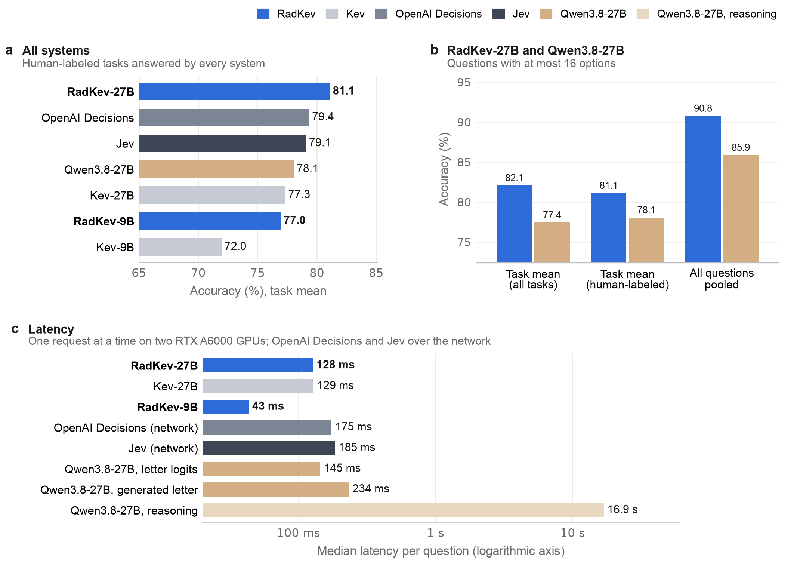
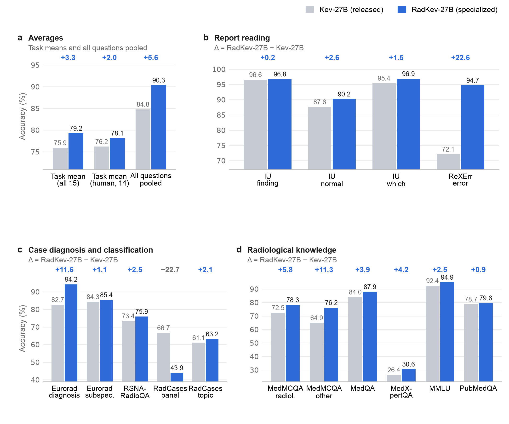

<div align="center">

# RadKev

**RadKev: An Open-Weight Decision Model for Radiology**

Udbhav Ram and Ran Zhang · University of Wisconsin–Madison

[](https://github.com/udiram/RadKev/actions/workflows/ci.yml)
[](LICENSE)
[](MODEL_CARD.md)
[](https://github.com/jaredpalmer/kev)
[](MODEL_CARD.md)

</div>

This repository contains the code, results, figures and manuscript source of the RadKev study. RadKev-27B and RadKev-9B are
radiology-specialized decision models, obtained by continued training of the general-purpose decision models Kev-27B and Kev-9B
([Kev](https://github.com/jaredpalmer/kev)) on 36,109 records from public radiology datasets. A decision model reads a *state* (a
report, a case or a clinical indication) together with one or more typed questions and returns, in one forward pass, a probability
for every admissible answer of every question. The study compares specialization with the principal alternatives for use within an
institution: larger general-purpose decision models and large language models (LLMs) of the same size.

## Summary

RadKev-27B and RadKev-9B were evaluated on a radiology benchmark of 14,142 held-out questions in fifteen tasks (report reading, case
diagnosis and classification, radiological knowledge), against the Kev models they were specialized from, an LLM of the same size
(Qwen3.8-27B, the backbone of Kev-27B) and the hosted decision models Jev and OpenAI Decisions. The prespecified primary outcome
was task-averaged accuracy relative to Kev-27B. Differences are paired, with 95% confidence intervals from a source-stratified
cluster bootstrap (2,000 resamples).

- **Primary outcome.** RadKev-27B exceeded Kev-27B by 4.9 percentage points (95% CI 3.8 to 6.2), with the largest gains in report
  error detection (22.6 points) and Eurorad diagnosis (11.6 points); RadKev-9B exceeded Kev-9B by 6.9 points (5.5 to 8.4) and did
  not differ detectably from Kev-27B, a model three times its size.
- **Decision models and LLMs.** RadKev-27B was more accurate than Qwen3.8-27B with reasoning disabled (4.7 points, 3.4 to 6.0)
  and with reasoning enabled (2.8 points, 1.0 to 4.6) on a sample of 1,675 questions, at 132-fold lower latency (128 ms vs 16.9 s per question).
- **Hosted decision models.** RadKev-27B was more accurate than Jev (jev-1.13.0; 3.0 points, 1.7 to 4.4) and the OpenAI Decisions
  API (gpt-6-luna; 4.8 points, 3.2 to 6.4). Kev-27B, which reproduces Jev's interface with open weights, was less accurate than Jev
  (1.9 points, 0.3 to 3.4).
- **Selective prediction.** At a 5% error budget, RadKev-27B could answer 90.5% of the benchmark questions (Kev-27B 76.4%).
- **External test.** On 4,037 status questions from radiologist-annotated RadGraph-XL reports of another institution,
  specialization changed accuracy by −1.1 points (−1.6 to −0.6) at 27B and by 1.8 points (1.0 to 2.6) at 9B.

<p align="center"></p>
<p align="center"><sub><b>Figure 5 of the manuscript.</b> Decision models and language models: task-averaged accuracy of every system on the
thirteen human-assigned tasks that all systems answered (a), RadKev-27B and Qwen3.8-27B on the questions with at most 16 options (b), and
median latency per question (c).</sub></p>

## Models

| Model | Started from | Backbone (frozen) | Trained parameters | Weights |
|---|---|---|---|---|
| **RadKev-27B** | Kev-27B (`01b8199`) | Qwen3.8-27B | rank-16 LoRA + pointer head; T = 1.35 | [`ramu9703/radkev-27b`](https://huggingface.co/ramu9703/radkev-27b) |
| **RadKev-9B** | Kev-9B (`2629c06`) | Qwen3.5-9B-Base | rank-16 LoRA + pointer head; T = 1.35 | [`ramu9703/radkev-9b`](https://huggingface.co/ramu9703/radkev-9b) |

The weights are released under CC BY-NC-SA 4.0 for non-commercial research use, because several training sources (Eurorad, CT-RATE)
carry that license; access on the Hugging Face Hub requires acceptance of these terms. T is the temperature fitted on the
development split. On the RadCases ACR panel question, the manuscript's results apply a prior correction to the raw outputs (see
[Methods](#methods)). See the [model card](MODEL_CARD.md) for intended use and limitations.

## Data

Every source is public: IU/Open-i, CT-RATE, ReXErr (on MIMIC-CXR), Eurorad, RadCases, RSNA-RadioQA, MedMCQA, MedQA, MMLU, PubMedQA
and MedXpertQA for the benchmark and training, CheXpert Plus and ReXGradient-160K for the LLM-labeled training questions, and
RadGraph-XL for the external test. [docs/DATA.md](docs/DATA.md) lists their licenses and how to obtain them, and `radkev.data`
rebuilds the records deterministically. The Hugging Face dataset
[`ramu9703/radkev-data`](https://huggingface.co/datasets/ramu9703/radkev-data) holds the released data: the question records built
from the openly licensed sources and, for the access-controlled sources, identifiers, state hashes and answer keys without text.

## Quick start

```bash
git clone https://github.com/udiram/RadKev.git && cd RadKev
scripts/setup.sh                                  # Kev at the pinned commit + venv, with radkev installed into it
source ~/.cache/radkev/kev/.venv/bin/activate
```

Ask a checkpoint the three example requests in [`examples/`](examples/) (written for illustration, not taken from any dataset):

```bash
python examples/quickstart.py --run ramu9703/radkev-9b
python examples/quickstart.py --run jaredpalmer/kev-4b           # the general-purpose model, small enough for a laptop
```

Serve a checkpoint over HTTP with Kev's server:

```bash
python -m kev.serve --run ramu9703/radkev-27b --port 8009
examples/request.sh                                               # POST /v1/systemone
```

From Python:

```python
from radkev.predict import Predictor

radkev = Predictor("ramu9703/radkev-27b")
out = radkev({"state": "FINDINGS: Small left pleural effusion. No pneumothorax.",
              "questions": {"ptx": {"type": "noul", "instructions": "Does this report describe pneumothorax?"}}})
out["answers"]["ptx"]["noul"]       # P(yes)
```

A request is the [TypeSafe System One](https://docs.typesafe.ai/api) body that Kev serves. Questions are of three types, `noul`
(yes/no), `choice` (named options) and `score` (ordered levels), and every answer is returned as a full distribution over the
admissible options. All questions about one state are answered in one pass and cannot read each other.

RadKev-27B requires about 55 GB in bfloat16: one 80 GB GPU, or two 48 GB GPUs with `KEV_DEVICE_MAP=auto KEV_DTYPE=bf16` (enabled
by [`patches/kev_multigpu.patch`](patches/kev_multigpu.patch), which `setup.sh` applies; verified to give scores identical to
single-GPU inference). RadKev-9B fits on one 48 GB GPU.

## Methods

**Data.** The benchmark covers three kinds of decision made on radiology text: reading a report (IU/Open-i chest radiograph reports:
finding present, normal study, which finding; ReXErr: whether a report contains an injected error), diagnosing or classifying a case
(Eurorad diagnosis and subspecialty, RadCases ACR Appropriateness Criteria panel and topic, RSNA-RadioQA) and applying radiological
knowledge (the radiology questions of MedMCQA, MedQA, MMLU, PubMedQA and MedXpertQA). Records were split by patient or case into
36,109 training, 6,176 development and 17,304 test records; official test sets were retained and one instruction wording per
question kind was withheld from training. Of the 14,142 benchmark questions, 11,434 have keys assigned by people and the 2,708 ReXErr
questions have keys known by construction. See [docs/DATA.md](docs/DATA.md).

**LLM-labeled training data.** Decisions about imaging orders, triage and follow-up have no public answer keys. Candidate questions
generated from public reports and clinical indications were answered by two LLM teachers, MedGemma-27B-text and Qwen3.8-27B, and
retained only if both ranked the same answer first; the mean of the two distributions served as a soft target. These questions were
used for training only and are not benchmarked.

**Training.** Kev adds a rank-16 low-rank adapter to every linear projection of a frozen backbone, together with a pointer head that
scores each option against its question. RadKev-27B and RadKev-9B were trained for one epoch (4,620 optimizer steps, effective batch
of 8 records) from the released Kev-27B and Kev-9B, with 1,000 records of Kev's own training data replayed to limit the loss of
general decision skill: RadKev-27B in 13.1 h and RadKev-9B in 3.4 h, each on four RTX A6000 GPUs. A temperature was then fitted on
the development split.

**Evaluation.** The models, benchmark and outcomes were specified in an analysis plan before any result of these models was read
([docs/ANALYSIS_PLAN_ADDENDUM.md](docs/ANALYSIS_PLAN_ADDENDUM.md)). LLMs were scored zero-shot, one question per prompt, from the
softmax of their next-token logits over the option letters with reasoning disabled, and with reasoning enabled on a sample of 1,675
questions. Jev and the OpenAI Decisions API received each record once, with all of its questions in one request.

**RadCases panel prior correction.** The catch-all option of the RadCases panel question ("no ACR Appropriateness Criteria topic
applies") was the most frequent panel answer in the training split (34%), and the specialized models adopted it as their default
(selected for 70.7% of questions whose key was a panel; accuracy 43.9%). Their answer distributions on this question were therefore
corrected post hoc for the training answer frequencies: each option's probability is divided by its add-one-smoothed frequency among
the training-split panel answers and renormalized, which uses only training labels and involves no retraining. All reported results
for RadKev-27B and RadKev-9B include the correction (RadKev-27B accuracy on the task 67.4%, Kev-27B 66.7%).

<p align="center"></p>
<p align="center"><sub><b>Figure 2 of the manuscript.</b> Architecture of Kev, the decision model fine-tuned in this study, shown for Kev-27B.</sub></p>

## Results

All results are on the held-out test split; values in parentheses are 95% confidence intervals of paired differences.

| System | Type | Size | Benchmark task mean (15 tasks) | Common human-assigned tasks (13) |
|---|---|---:|---:|---:|
| **RadKev-27B** | decision model, radiology | 27B | **80.8** | **81.1** |
| **RadKev-9B** | decision model, radiology | 9B | 77.0 | 77.0 |
| Kev-27B | decision model, general | 27B | 75.9 | 77.3 |
| Kev-9B | decision model, general | 9B | 70.1 | 72.0 |
| OpenAI Decisions (gpt-6-luna) | decision model, hosted | – | 76.0 | 79.4 |
| Jev (jev-1.13.0) | decision model, hosted | – | 77.8 | 79.1 |
| Qwen3.8-27B | LLM, general | 27B | – | 78.1 |

<sub>Accuracy (%), unweighted mean of the task accuracies. Qwen3.8-27B was not scored on the RadCases topic question (225 options), so
its benchmark comparisons use the fourteen tasks with at most 16 options (manuscript, Section 3.2). Per-task results and
confidence intervals are in the manuscript's supplementary tables and in [`results/manuscript/`](results/manuscript/).</sub>

<p align="center"></p>
<p align="center"><sub><b>Figure 4 of the manuscript.</b> Accuracy of Kev-27B and RadKev-27B on the radiology benchmark.</sub></p>

**Specialization and scale.** Specialization changed the benchmark task mean by 4.9 points at 27B and 6.9 at 9B, and the threefold
increase in size from Kev-9B to Kev-27B by 5.8; at 27B the two gains did not differ detectably (−0.9, −3.1 to 1.6). On Kev's
out-of-domain transfer suite, accuracy changed by −0.6 points (−2.3 to 1.2) at 27B and 1.5 (0.0 to 3.1) at 9B.

**Calibration and selective prediction.** On the human-assigned questions, RadKev-27B could answer 88.4% at a 5% error budget
(Kev-27B 85.5%; 2.9 points, 1.9 to 3.9), with an expected calibration error of 0.015 (Kev-27B 0.018), but it made more confident
errors (1.4% vs 0.6% of questions).

**Robustness.** In the options-only control, with the case removed, RadKev-27B still selected the correct Eurorad diagnosis in 76.9%
of questions (Kev-27B 47.7%, chance 24%), so the Eurorad gain reflects recognition of the correct option rather than reading of the
case. The gain was 0.7 points on instruction wordings withheld from training and 2.9 on wordings seen in training.

**Answer space.** Accuracy depended more on how similar the alternatives were to the correct answer than on how many were offered;
the latency of a decision model rises with the number of options, which favors short answer spaces.

## Limitations

- The RadCases and ReXErr test splits come from the same collections as their training splits; ReXErr's errors were inserted by an
  LLM. The only test set from a source not used in training was RadGraph-XL, on which the 27B model lost accuracy.
- The RadCases panel results of the specialized models include a post hoc prior correction for the training answer frequencies.
- The questions on imaging orders, triage and follow-up were labeled by agreement of two LLMs without validation against human
  judgment and were used for training only.
- All data were drawn from public datasets and teaching collections; the models were not validated on institutional reports, and
  accuracy was not examined across patient subgroups or institutions.
- The LLM was evaluated zero-shot with a single prompt, and no LLM was fine-tuned on the same data. Every model was trained once,
  with a single random seed.
- Public examination questions and Eurorad cases may have been part of the pretraining data of every model; paired differences, not
  absolute accuracies, are the basis of the conclusions.
- Latency was measured one request at a time; LLMs served with batching may achieve higher throughput.
- All questions were posed on text; the study does not address decisions that require the images.

## Reproducing the study

[`paper/`](paper/) reproduces every number, table and figure of the manuscript from the aggregate job outputs in `paper/inputs/`:
`python3 build.py --no-pdf`, then `python3 v3/build_v3.py --strict`, then `python3 build.py` (see [paper/README.md](paper/README.md)).
The job scripts of the final runs are in [`experiments/final/`](experiments/final/), and [docs/REPRODUCE.md](docs/REPRODUCE.md)
describes data construction, teacher labeling and training. [`results/`](results/) contains the aggregate results and the number
ledgers, which list every number in the manuscript with the file and field it was taken from.

## Repository

```
radkev/            the library (each module is also a CLI: python -m radkev.<module> --help)
  data.py          sources -> Kev records: patient/case splits, withheld wordings, leak filters
  teacher.py       two-teacher agreement labels; zero-shot LLM scorer (option-letter probabilities)
  evaluate.py      score a checkpoint or precomputed probabilities with Kev's metrics
  compare.py       paired cluster-bootstrap comparisons by task, label type and wording
  predict.py       in-process inference returning System One answers
  fetch.py         download the open sources
experiments/       the runs behind the reported numbers (final/: the job scripts of the manuscript's final runs)
patches/           the two-GPU split for Kev-27B on 48 GB GPUs
results/           aggregate results, the manuscript's number ledgers and supplementary tables
paper/             the manuscript source, build.py and v3/build_v3.py, which generate every number, table and figure from paper/inputs/
figures/           the manuscript figures
docs/              data, evaluation, analysis plan and reproduction
examples/          example requests written for illustration and a quick-start script
tests/             tests on synthetic fixtures (run against Kev's metrics in CI)
```

## Intended use

RadKev is a research model. It is not a medical device, has not been prospectively validated and must not be used for clinical
decisions. It reads English text only (reports, vignettes, clinical indications), never images. Before any local evaluation, the
temperature should be refitted and automation thresholds set on locally labeled cases, and the answer spaces should be checked to
contain the correct answer; the manuscript's Discussion gives guidance on choosing answer spaces.

## Citation

```bibtex
@article{ram2026radkev,
  title  = {RadKev: An Open-Weight Decision Model for Radiology},
  author = {Ram, Udbhav and Zhang, Ran},
  year   = {2026},
  note   = {Manuscript in preparation},
  url    = {https://github.com/udiram/RadKev}
}
```

## Acknowledgments

RadKev is built on [Kev](https://github.com/jaredpalmer/kev) by Jared Palmer (Apache-2.0) and on the Qwen backbones. We thank the
providers of the datasets: Open-i and Indiana University (IU chest radiograph reports), the European Society of Radiology (Eurorad)
and the authors of `wanglab/eurorad-reasoning`, the CT-RATE, CheXpert Plus, ReXGradient-160K, ReXErr, RadCases, RSNA-RadioQA and
RadGraph-XL teams, and the authors of MedMCQA, MedQA, MMLU, PubMedQA and MedXpertQA. Models: MedGemma (Google; teacher for
labeling), Qwen3.8 (Alibaba), Jev (TypeSafe) and the OpenAI Decisions API.
