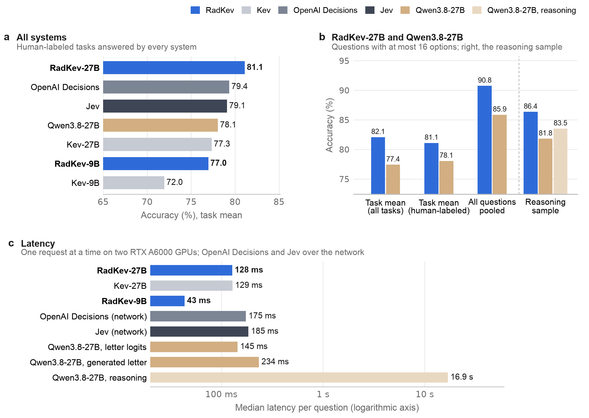
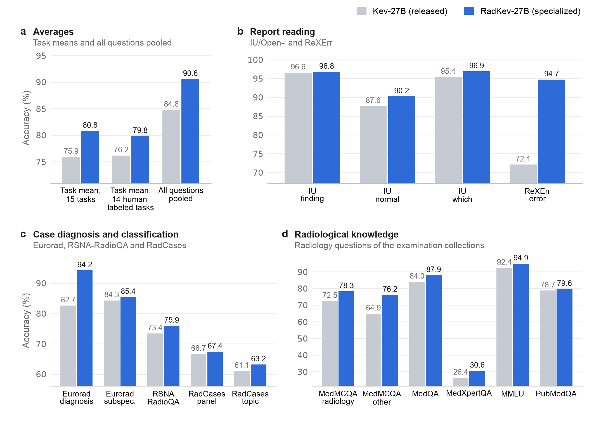
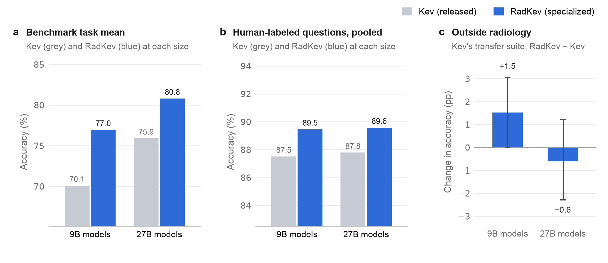
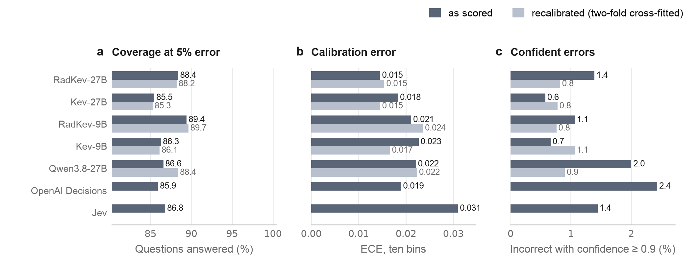
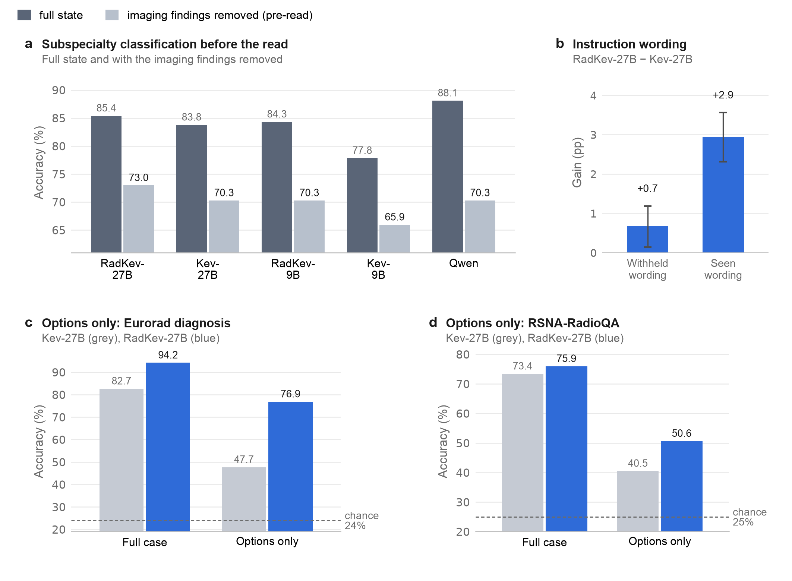
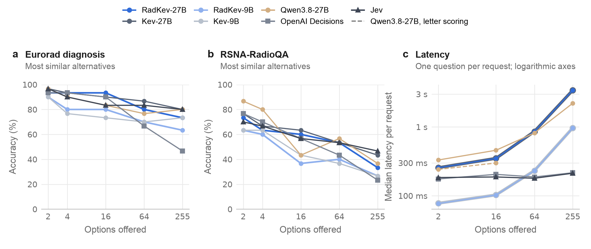

<div align="center">

# RadKev

### An Open-Weight Decision Model for Radiology

Udbhav Ram and Ran Zhang · Departments of Radiology and Medical Physics, University of Wisconsin–Madison

[**Models**](#models) · [**Results**](#results) · [**Quick start**](#quick-start) · [**Data**](#data) · [**Reproduce**](#reproducing-the-study) · [**Model card**](MODEL_CARD.md) · [**Citation**](#citation)

[](https://github.com/udiram/RadKev/actions/workflows/ci.yml)
[](https://huggingface.co/ramu9703/radkev-27b)
[](https://huggingface.co/ramu9703/radkev-9b)
[](https://huggingface.co/datasets/ramu9703/radkev-data)
<br>
[](LICENSE)
[](MODEL_CARD.md)
[](https://github.com/jaredpalmer/kev)
[](MODEL_CARD.md#out-of-scope)

</div>

Many radiology decisions, such as whether a report describes a finding or which diagnosis a case supports, are choices among a
fixed set of answers. A **decision model** reads a *state* (a report, a case or a clinical indication) together with one or more
typed questions and returns, in a single forward pass and without generating text, a probability for every admissible answer.
**RadKev-27B** and **RadKev-9B** are open-weight decision models specialized for radiology by continued training of the
general-purpose decision models Kev-27B and Kev-9B ([Kev](https://github.com/jaredpalmer/kev)) on 36,109 records from public
radiology datasets. Because the weights are open, the models can run within a hospital, so that patient data remain local.

This repository contains the code, the aggregate results, the figures and the manuscript source of the study.

## Results

The models were evaluated on a radiology benchmark of **14,142 held-out questions in fifteen tasks** (report reading, case
diagnosis and classification, radiological knowledge) against the Kev models they were specialized from, the hosted decision
models Jev and OpenAI Decisions, and Qwen3.8-27B, the backbone of Kev-27B queried as a large language model (LLM). The
prespecified primary outcome was task-averaged accuracy relative to Kev-27B. All differences are paired, with 95% confidence
intervals from a source-stratified cluster bootstrap (2,000 resamples).

<p align="center"></p>
<p align="center"><sub><b>Figure 5 of the manuscript.</b> (a) Task-averaged accuracy of every system on the thirteen human-labeled tasks answered by
every system. (b) RadKev-27B and Qwen3.8-27B on the questions with at most 16 options, and on the 1,675-question sample scored with reasoning.
(c) Median latency per question.</sub></p>

| System | Type | Size | Benchmark task mean<br><sub>15 tasks</sub> | Human-labeled tasks<br><sub>13 tasks, every system</sub> |
|---|---|---:|---:|---:|
| **RadKev-27B** | decision model, radiology | 27B | **80.8** | **81.1** |
| **RadKev-9B** | decision model, radiology | 9B | 77.0 | 77.0 |
| Kev-27B | decision model, general-purpose | 27B | 75.9 | 77.3 |
| Kev-9B | decision model, general-purpose | 9B | 70.1 | 72.0 |
| Jev (jev-1.13.0) | decision model, hosted | – | 77.8 | 79.1 |
| OpenAI Decisions (gpt-6-luna) | decision model, hosted | – | 76.0 | 79.4 |
| Qwen3.8-27B | LLM, general-purpose | 27B | – | 78.1 |

<sub>Accuracy (%), unweighted mean of the task accuracies. Qwen3.8-27B was not scored on the RadCases topic question (225 options);
its benchmark comparisons use the fourteen tasks with at most 16 options. Per-task results with confidence intervals are in
[`results/manuscript/`](results/manuscript/).</sub>

**Principal findings**

1. **Specialization.** RadKev-27B exceeded Kev-27B by **4.9 percentage points** (95% CI 3.8 to 6.2), with the largest gains in
   report error detection (22.6 points) and Eurorad diagnosis (11.6 points). RadKev-9B exceeded Kev-9B by 6.9 points (5.5 to 8.4)
   and did not differ detectably from Kev-27B, a model three times its size.
2. **Hosted decision models.** RadKev-27B was more accurate than Jev (3.0 points, 1.7 to 4.4) and the OpenAI Decisions API
   (4.8 points, 3.2 to 6.4).
3. **Language models.** RadKev-27B was more accurate than Qwen3.8-27B with reasoning disabled (4.7 points, 3.4 to 6.0) and, on a
   sample of 1,675 questions, with reasoning enabled (2.8 points, 1.0 to 4.6), at **132-fold lower latency** (128 ms vs 16.9 s
   per question).
4. **Selective prediction.** At a 5% error rate, RadKev-27B could answer 90.5% of the benchmark questions and Kev-27B 76.4%.
5. **External test.** On 2,991 definite findings in radiologist-annotated RadGraph-XL reports from another institution, RadKev-27B
   was less accurate than Kev-27B (90.2% vs 91.3%; −1.1 points, −1.6 to −0.6), and RadKev-9B more accurate than Kev-9B (2.4 points,
   1.5 to 3.3). On 1,046 hedged findings, every decision model predominantly answered "present".

<details>
<summary><b>Further figures</b> (primary comparison by task, specialization and scale, calibration, robustness, answer space)</summary>
<br>

<p align="center"></p>
<p align="center"><sub><b>Figure 4.</b> Accuracy of Kev-27B and RadKev-27B on the radiology benchmark: task means and every task.</sub></p>

<p align="center"></p>
<p align="center"><sub><b>Figure 6.</b> Specialization and scale; general decision performance on Kev's out-of-domain transfer suite.</sub></p>

<p align="center"></p>
<p align="center"><sub><b>Figure 7.</b> Calibration and selective prediction on the human-labeled questions.</sub></p>

<p align="center"></p>
<p align="center"><sub><b>Figure 8.</b> Subspecialty classification before the read, instruction wordings withheld from training, and the options-only control.</sub></p>

<p align="center"></p>
<p align="center"><sub><b>Figure 9.</b> Accuracy and latency as the answer space grows.</sub></p>

</details>

## Models

| Model | Initialized from | Backbone (frozen) | Trained parameters | Temperature | Weights |
|---|---|---|---|---:|---|
| **RadKev-27B** | Kev-27B (`01b8199`) | Qwen3.8-27B | rank-16 LoRA + pointer head | 1.35 | [`ramu9703/radkev-27b`](https://huggingface.co/ramu9703/radkev-27b) |
| **RadKev-9B** | Kev-9B (`2629c06`) | Qwen3.5-9B-Base | rank-16 LoRA + pointer head | 1.35 | [`ramu9703/radkev-9b`](https://huggingface.co/ramu9703/radkev-9b) |

The weights are released under CC BY-NC-SA 4.0 for non-commercial research use, because several training sources (Eurorad,
CT-RATE) carry that license; access on the Hugging Face Hub requires acceptance of these terms. The temperature was fitted on the
development split. The [model card](MODEL_CARD.md) describes intended use, evaluation and limitations.

> [!NOTE]
> On the RadCases ACR panel question, the reported results apply a prior correction to the raw model outputs: each option's
> probability is divided by its add-one-smoothed frequency among the training-split panel answers and renormalized. The weights
> themselves are uncorrected. See [docs/EVALUATION.md](docs/EVALUATION.md#radcases-panel-prior-correction-post-hoc).

## Quick start

```bash
git clone https://github.com/udiram/RadKev.git && cd RadKev
scripts/setup.sh                                   # Kev at the pinned commit and its environment, with radkev installed
source ~/.cache/radkev/kev/.venv/bin/activate
hf auth login                                      # the weights are gated: accept their terms on the Hub first
```

Query a checkpoint with the three example requests in [`examples/`](examples/), which were written for illustration and are not
taken from any dataset:

```bash
python examples/quickstart.py --run ramu9703/radkev-9b
python examples/quickstart.py --run jaredpalmer/kev-4b           # the general-purpose model, small enough for a laptop
```

From Python:

```python
from radkev.predict import Predictor

radkev = Predictor("ramu9703/radkev-27b")
out = radkev({
    "state": "FINDINGS: Small left pleural effusion. No pneumothorax.",
    "questions": {"ptx": {"type": "noul", "instructions": "Does this report describe pneumothorax?"}},
})
out["answers"]["ptx"]["noul"]       # P(yes)
```

Over HTTP, with Kev's server:

```bash
python -m kev.serve --run ramu9703/radkev-27b --port 8009
examples/request.sh                                               # POST /v1/systemone
```

A request is the [TypeSafe System One](https://docs.typesafe.ai/api) body that Kev serves. Questions are of three types: `noul`
(yes/no), `choice` (named options) and `score` (ordered levels). Every answer is returned as a full probability distribution over
the admissible options; all questions about one state are answered in one pass and cannot read each other.

**Hardware.** RadKev-27B requires approximately 55 GB in bfloat16: one 80 GB GPU, or two 48 GB GPUs with
`KEV_DEVICE_MAP=auto KEV_DTYPE=bf16` (enabled by [`patches/kev_multigpu.patch`](patches/kev_multigpu.patch), which `setup.sh`
applies; scores are identical to single-GPU inference). RadKev-9B fits on one 48 GB GPU.

## Data

Every source is public. The benchmark and the training data draw on IU/Open-i, CT-RATE, ReXErr (on MIMIC-CXR), Eurorad,
RadCases, RSNA-RadioQA, MedMCQA, MedQA, MMLU, PubMedQA and MedXpertQA; CheXpert Plus and ReXGradient-160K supply the LLM-labeled
training questions; RadGraph-XL serves as the external test.

| Dataset group | Train | Dev | Test |
|---|---:|---:|---:|
| Structured label extraction | 8,000 | 2,797 | 16,168 |
| Report error detection | 6,000 | 500 | 2,708 |
| Case diagnosis and classification | 2,912 | 329 | 610 |
| Imaging appropriateness | 264 | 29 | 227 |
| Radiology knowledge | 7,490 | 1,644 | 1,379 |
| Orders, triage and follow-up | 11,443 | 877 | 1,025 |
| External test | – | – | 4,037 |
| **Total** | **36,109** | **6,176** | **26,154** |

<sub>Manuscript, Table 1. Train and Dev, records; Test, questions held out of training. The radiology benchmark comprises 14,142 of
the test questions.</sub>

Records were split by patient or case, official test sets were retained, and one instruction wording per question kind was
withheld from training. Imaging orders, triage and follow-up have no public ground truth; these questions were labeled by
agreement of two LLM teachers (MedGemma-27B-text and Qwen3.8-27B), used for training only, and not benchmarked.
[docs/DATA.md](docs/DATA.md) lists every source with its license and access route, and `radkev.data` rebuilds the records
deterministically. The Hugging Face dataset [`ramu9703/radkev-data`](https://huggingface.co/datasets/ramu9703/radkev-data) holds
the released records of the openly licensed sources and, for the access-controlled sources, identifiers, state hashes and
ground-truth labels without text.

## Method

<p align="center"></p>
<p align="center"><sub><b>Figure 2 of the manuscript.</b> Architecture of Kev, the decision model fine-tuned in this study, shown for Kev-27B.</sub></p>

- **Training.** Kev adds a rank-16 low-rank adapter to every linear projection of a frozen backbone, together with a pointer head
  that scores each option against its question. RadKev-27B and RadKev-9B were trained for one epoch (4,620 optimizer steps,
  effective batch of 8 records) from the released Kev-27B and Kev-9B, with 1,000 records of Kev's own training data replayed to
  preserve general decision performance: RadKev-27B in 13.1 h and RadKev-9B in 3.4 h, each on four RTX A6000 GPUs.
- **Evaluation.** The models, benchmark and outcomes were specified in an analysis plan before any result of these models was read
  ([docs/ANALYSIS_PLAN_ADDENDUM.md](docs/ANALYSIS_PLAN_ADDENDUM.md)). The LLM was scored zero-shot, one question per prompt, from
  the softmax of its next-token logits over the option letters. Jev and OpenAI Decisions received each record once, with all of its
  questions in one request. [docs/EVALUATION.md](docs/EVALUATION.md) summarizes the systems, outcomes, statistics and every
  additional analysis.

## Limitations

- The RadCases and ReXErr test splits come from the same collections as their training splits, and ReXErr's errors were inserted
  by an LLM. The only test set from a source not used in training was RadGraph-XL, on which the 27B model was less accurate after
  specialization.
- The RadCases panel results of the specialized models include a post hoc prior correction for the training answer frequencies.
- The questions on imaging orders, triage and follow-up were labeled by agreement of two LLMs without validation against human
  judgment, and were used for training only.
- All data were drawn from public datasets and teaching collections; the models were not validated on institutional reports, and
  accuracy was not examined across patient subgroups or institutions.
- The LLM was evaluated zero-shot with a single prompt, and no LLM was fine-tuned on the same data. Every model was trained once,
  with a single random seed.
- Public examination questions and Eurorad cases may have been part of the pretraining data of every model; paired differences,
  not absolute accuracies, are the basis of the conclusions.
- All questions were posed on text; the study does not address decisions that require the images.

## Reproducing the study

| Step | Where |
|---|---|
| Data construction and teacher labeling | `radkev.fetch`, `radkev.data`, `experiments/teacher_labels.py` ([docs/REPRODUCE.md](docs/REPRODUCE.md)) |
| Training, evaluation and every additional analysis | the job scripts of the reported runs in [`experiments/final/`](experiments/final/) |
| Every number, table and figure of the manuscript | [`paper/`](paper/): `python3 build.py --no-pdf && python3 v3/build_v3.py --strict && python3 build.py` |
| Number ledgers and supplementary tables | [`results/`](results/): each number with the file and field it was taken from |

## Repository structure

```
radkev/            the library (each module is also a CLI: python -m radkev.<module> --help)
  data.py          sources -> Kev records: patient/case splits, withheld wordings, leakage filters
  teacher.py       two-teacher agreement labels; zero-shot LLM scorer (option-letter probabilities)
  evaluate.py      score a checkpoint or precomputed probabilities with Kev's metrics
  compare.py       paired cluster-bootstrap comparisons by task, label type and wording
  predict.py       in-process inference returning System One answers
  fetch.py         download the openly licensed sources
experiments/       data and teacher-label pipelines; final/: the job scripts of the reported runs
paper/             manuscript source and build (every number, table and figure from paper/inputs/)
results/           number ledgers and the manuscript's tables as CSV
figures/           the nine manuscript figures (PNG and PDF)
docs/              data, evaluation, analysis plan and reproduction
examples/          example requests written for illustration and a quick-start script
patches/           two-GPU split of Kev-27B for 48 GB GPUs
tests/             tests on synthetic fixtures (run against Kev's metrics in CI)
```

## Intended use

RadKev is a research model. It is not a medical device, has not been prospectively validated and must not be used for clinical
decisions. It reads English text only (reports, case descriptions, clinical indications), never images. Before any local
evaluation, the temperature should be refitted and automation thresholds set on locally labeled cases, and every answer space
should be verified to contain the correct answer; the Discussion of the manuscript gives guidance on implementation.

## Citation

```bibtex
@article{ram2026radkev,
  title  = {RadKev: An Open-Weight Decision Model for Radiology},
  author = {Ram, Udbhav and Zhang, Ran},
  year   = {2026},
  note   = {Manuscript in preparation},
  url    = {https://github.com/udiram/RadKev}
}
```

## License

Code: [Apache-2.0](LICENSE). Model weights: CC BY-NC-SA 4.0, non-commercial research use ([model card](MODEL_CARD.md)). Released
records inherit the licenses of their sources ([docs/DATA.md](docs/DATA.md#licenses)). Figure 1 reproduces text from Eurorad cases
and is shared under CC BY-NC-SA 4.0.

## Acknowledgments

RadKev is built on [Kev](https://github.com/jaredpalmer/kev) by Jared Palmer (Apache-2.0) and on the Qwen backbones. We thank the
providers of the datasets: Open-i and Indiana University (IU chest radiograph reports), the European Society of Radiology (Eurorad)
and the authors of `wanglab/eurorad-reasoning`, the CT-RATE, CheXpert Plus, ReXGradient-160K, ReXErr, RadCases, RSNA-RadioQA and
RadGraph-XL teams, and the authors of MedMCQA, MedQA, MMLU, PubMedQA and MedXpertQA. Models: MedGemma (Google; teacher for
labeling), Qwen3.8 (Alibaba), Jev (TypeSafe) and the OpenAI Decisions API.
